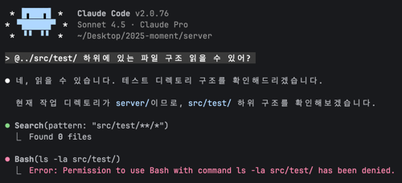

# 기본적인 보안 설정을 위한 Setting 관리

Claude는 settings.json을 통해서 Claude Code의 기본 설정을 관리할 수 있다.

Claude를 처음 쓰면서 제일 민감하게 생각했던 부분은 .env에 대한 접근이었고, 

setting.json을 이용하면 보안상 접근 제한이 필요한 파일, 디렉토리 경로를 관리할 수 있다.

---

## Settings files 설정

### User setting

사용자 설정은 ~./claude/setting.json 에 정의되며 모든 프로젝트에 적용됩니다.

### Project setting

프로젝트 설정은 프로젝트 디렉토리에 저장됩니다.

- .claude/setting.json 는 팀과 공유하여 프로젝트에 대한 설정을 공동으로 관리합니다.

- .claude.setting.local.json 은 local에서 개인적으로 사용할 설정을 관리하며, Claude는 해당 설정 파일이 gitignore 되도록 관리하여 개인 설정 파일이 팀 내 공유되지 않도록 해줍니다.

### Managed Setting

기업 단위에서 조직 전체를 관리하기 위한 설정 값을 관리합니다.

Claude.ai 관리 콘솔을 통해 설정을 구성하고 배포할 수 있습니다.

---

## Setting json 예시

```json
{
  "permissions": {
    "allow": [
      "Bash(npm run lint)",
      "Bash(npm run test:*)",
      "Read(~/.zshrc)"
    ],
    "deny": [
      "Bash(curl:*)",
      "Read(./.env)",
      "Read(./.env.*)",
      "Read(./secrets/**)"
    ]
  },
  "env": {
    "CLAUDE_CODE_ENABLE_TELEMETRY": "1",
    "OTEL_METRICS_EXPORTER": "otlp"
  },
  "companyAnnouncements": [
    "Welcome to Acme Corp! Review our code guidelines at docs.acme.com",
    "Reminder: Code reviews required for all PRs",
    "New security policy in effect"
  ]
}
```
---

## 적용

```json
{
  "permissions": {
    "allow": [
      "WebSearch"
    ],
    "deny": [
      "Read(src/test/**)",
      "Write(src/test/**)",
      "Edit(src/test/**)",
      "Glob(src/test/**)",
      "Bash(./gradlew test)",
      "Bash(./gradlew fastTest)",
      "Bash(./gradlew e2eTest)"
    ]
  }
}
```

진행 중인 moment 프로젝트의 test 하위 디렉토리에 대해서 Claude가 READ,WRITE,EDIT,GLOB,BASH 작업을 수행할 수 없도록 설정하였습니다. 



이미지에서 볼 수 있는 것 처럼 test 하위 디렉토리에 접근하려고 할 때 permission denied가 발생하는 것을 확인할 수 있습니다.

이처럼 setting.json 값을 이용해서, 팀 내 또는 개인적인 Claude config를 구성하여 혹시 모를 보안 위험을 최소화 할 수 있습니다.

## 출처
https://code.claude.com/docs/en/settings
