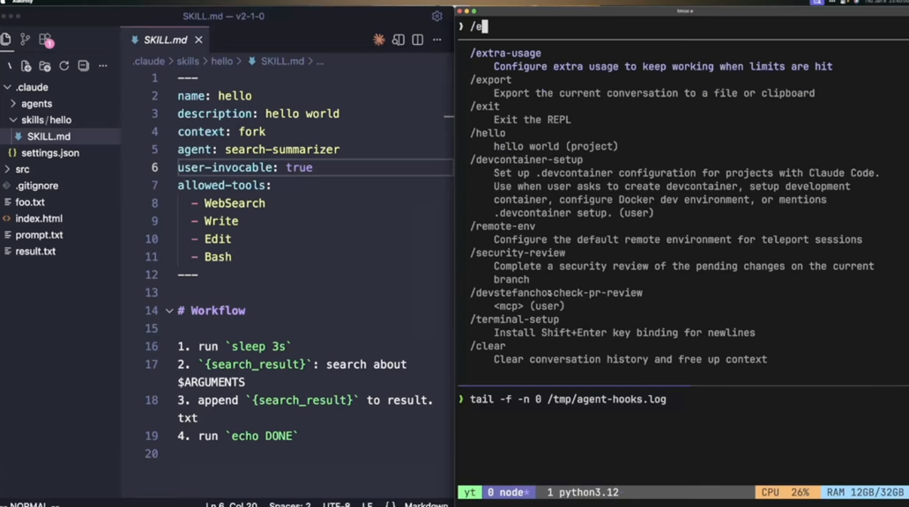

## MCP (Model Context Protocol)

- 외부 시스템 연결 표준 제시

## Skills

- 재사용 가능한 워크플로우 패키지 시스템

## Sub-agents

- 전문화된 AI 어시스턴트




---

## Skills vs SubAgent

Skills와 SubAgent(Task tool)는 비슷해 보이지만 목적과 사용 방식이 다릅니다.

## Skills vs SubAgent 비교

### Skills (스킬)

**정의**: 특정 파일 형식이나 작업에 대한 **전문 지식과 베스트 프랙티스**를 담은 가이드입니다.

**특징**:
- 현재 대화 컨텍스트 **안에서** 실행됨
- 특정 파일 형식(docx, xlsx, pptx, pdf) 생성/편집에 최적화된 **지침**을 제공
- 스킬을 로드하면 해당 작업을 잘 수행하는 방법에 대한 상세 프롬프트가 확장됨
- **동기적** - 스킬 지침을 따라 순차적으로 작업

**사용 시점**:
- Word 문서, Excel, PowerPoint, PDF 생성/편집할 때
- 특정 형식의 고품질 결과물이 필요할 때

---

### SubAgent (Task tool)

**정의**: 복잡한 작업을 처리하기 위해 **별도로 생성되는 독립 에이전트**입니다.

**특징**:
- 현재 대화와 **별개의 프로세스**로 실행됨
- 자체 컨텍스트와 도구 접근 권한을 가짐
- **병렬 실행** 가능 - 여러 SubAgent를 동시에 띄울 수 있음
- 작업 완료 후 결과만 반환

**사용 시점**:
- **병렬화**: 독립적인 여러 작업을 동시에 처리할 때
- **컨텍스트 분리**: 토큰 비용이 높은 하위 작업을 메인 작업과 분리할 때
- 코드베이스 탐색, 대량 문서 분석, 검증 작업 등

---

## 시각적 비교

```
┌─────────────────────────────────────────────────────────────────┐
│                         Skills 방식                              │
├─────────────────────────────────────────────────────────────────┤
│                                                                 │
│   ┌─────────────────────────────────────────────────────────┐   │
│   │                    메인 Claude                          │   │
│   │                                                         │   │
│   │   1. 스킬 로드 (예: docx 스킬)                          │   │
│   │          ↓                                              │   │
│   │   2. 스킬 지침이 컨텍스트에 추가됨                       │   │
│   │          ↓                                              │   │
│   │   3. 지침에 따라 작업 수행                              │   │
│   │          ↓                                              │   │
│   │   4. 결과물 생성                                        │   │
│   │                                                         │   │
│   └─────────────────────────────────────────────────────────┘   │
│                                                                 │
│   특징: 단일 프로세스, 순차 실행, 전문 지식 활용                │
│                                                                 │
└─────────────────────────────────────────────────────────────────┘


┌─────────────────────────────────────────────────────────────────┐
│                       SubAgent 방식                              │
├─────────────────────────────────────────────────────────────────┤
│                                                                 │
│   ┌─────────────────────────────────────────────────────────┐   │
│   │                    메인 Claude                          │   │
│   │                        │                                │   │
│   │         ┌──────────────┼──────────────┐                 │   │
│   │         ↓              ↓              ↓                 │   │
│   │   ┌──────────┐   ┌──────────┐   ┌──────────┐            │   │
│   │   │ SubAgent │   │ SubAgent │   │ SubAgent │            │   │
│   │   │    A     │   │    B     │   │    C     │            │   │
│   │   │ (탐색)   │   │ (분석)   │   │ (검증)   │            │   │
│   │   └────┬─────┘   └────┬─────┘   └────┬─────┘            │   │
│   │        │              │              │                  │   │
│   │        └──────────────┼──────────────┘                  │   │
│   │                       ↓                                 │   │
│   │                  결과 수집                              │   │
│   └─────────────────────────────────────────────────────────┘   │
│                                                                 │
│   특징: 다중 프로세스, 병렬 실행, 독립적 컨텍스트               │
│                                                                 │
└─────────────────────────────────────────────────────────────────┘
```

---

## 실제 사용 예시

| 상황 | 사용할 것 | 이유 |
|------|----------|------|
| "Word 보고서 만들어줘" | **Skills** (docx) | 문서 형식 전문 지식 필요 |
| "3개 경쟁사 동시에 조사해줘" | **SubAgent** | 독립적 작업 병렬 처리 |
| "Excel로 데이터 분석해줘" | **Skills** (xlsx) | 스프레드시트 베스트 프랙티스 필요 |
| "코드베이스 탐색 후 버그 수정" | **SubAgent** | 대량 파일 탐색 후 컨텍스트 분리 |
| "PPT 발표자료 만들어줘" | **Skills** (pptx) | 프레젠테이션 전문 지침 필요 |
| "작업 결과 검증해줘" | **SubAgent** | 독립적 검증으로 정확도 향상 |

---

## 핵심 차이 요약

- **Skills** = "어떻게 잘 만들지"에 대한 **전문 가이드** (같은 컨텍스트)
- **SubAgent** = "병렬로 나눠서 처리"하는 **독립 작업자** (분리된 컨텍스트)

둘은 상호 배타적이지 않아서, SubAgent가 내부적으로 Skills의 지침을 활용할 수도 있습니다!


---

## Skills vs Custom Commands vs Custom SubAgent

### 실행 방식

Explicit -> Custom Commands => 우리가 무엇을 쓰라고 지정해주는 것
Implicit -> Skills, Custom SubAgent => Claude가 알아서 필요할 때, 도구들을 꺼내서 사용함

### Progressive Disclosure

Full => Custom Command, Custom SubAgent => 한번에 내용들을 전부다 가져옴 (전부 context 안에 넣어서 활용함)
Progressive => Skills => 필요한 것들만 선택적으로 가져옴

### 컨텍스트 소모

Full => Custom Command, Custom SubAgent => 전부 context 안에 넣어서 활용함
Progressive => Skills => 필요에 따라 넣는 만큼만 사용함

### 실행 컨텍스트

Main Agent => Custom Command, Skills
Subagent => Custom Subagent => Main Agent 의 컨텍스트를 아낄 수 있지만 Subagent에서 실행되었던 모든 내용을 Main Agent에서는 알 수 없다.

### Deterministic

Non-deterministic => Custom Command, Custom Subagent => LLM의 자유도에 맡기기 때문에 똑같은 input을 넣었을 때 매번 다른 결과가 나온다. => 물론 이것도 프롬프트 쓰면 가능할듯
Deterministic => Skills => Deterministic한 결과를 원한다면 효율적으로 받아볼 수 있도록 요청 가능하다. 


