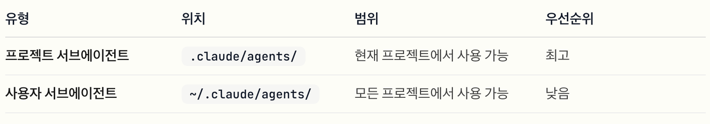

# 서브에이전트

Claude Code에서 특화된 AI 서브에이전트를 생성하고 사용하여 작업별 워크플로우 및 향상된 컨텍스트 관리를 구현합니다.

커스텀된 시스템 프롬프트, 도구 및 별도의 컨텍스트 윈도우를 제공하는 작업별 구성을 통해 더 효율적인 문제 해결을 가능하게 합니다.

특정 목적과 전문 분야를 가지고 있다.

**주 대화와 분리된 자체 컨텍스트 윈도우를 사용**합니다.

사용할 수 있는 특정 도구로 구성할 수 있습니다.

동작을 안내하는 커스텀 시스템 프롬프트를 포함합니다.

Claude Code가 서브에이전트의 전문 분야와 일치하는 작업을 만나면, 그 작업을 특화된 서브에이전트에 위임할 수 있으며, 서브에이전트는 독립적으로 작동하고 결과를 반환합니다.

### 주요 이점

- 컨텍스트 보존
각 서브에이전트는 자체 컨텍스트에서 작동하여 주 대화의 오염을 방지하고 고수준 목표에 집중하도록 유지합니다.

- 특화된 전문성
서브에이전트는 특정 도메인에 대한 상세한 지침으로 미세 조정할 수 있으므로 지정된 작업에서 더 높은 성공률을 달성합니다.

- 재사용성
한 번 생성되면 다양한 프로젝트에서 서브에이전트를 사용하고 팀과 공유하여 일관된 워크플로우를 구현할 수 있습니다.

- 유연한 권한
각 서브에이전트는 다양한 도구 접근 수준을 가질 수 있으므로 강력한 도구를 특정 서브에이전트 유형으로 제한할 수 있습니다.

---

## 서브 에이전트 구성하기

서브에이전트는 YAML 프론트매터가 있는 마크다운 파일로 저장되며 두 가지 가능한 위치에 있습니다:

플러그인 에이전트 위치: 플러그인은 agents/ 디렉토리(또는 플러그인 매니페스트에 지정된 커스텀 경로)에 에이전트를 포함합니다.
플러그인 에이전트 사용:
플러그인 에이전트는 커스텀 에이전트와 함께 /agents에 나타납니다
명시적으로 호출할 수 있습니다: “Use the code-reviewer agent from the security-plugin”
Claude가 적절할 때 자동으로 호출할 수 있습니다
/agents 인터페이스를 통해 관리(보기, 검사)할 수 있습니다
