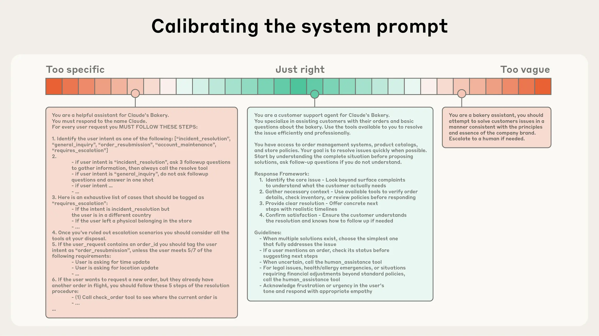

# Agent Engineering

LLM의 위에 구축되지만 자율성, 지속성, 코드 실행 및 다단계 추론의 개념을 도입힌다. 

모델에게 단일 프롬프트에 응답하도록 요청하는 대신, 목표를 설정하고, 작업을 분해하며, 정보를 검색하고, 다른 에이전트와 협력하고,

시간이 지남에 따라 행동을 조정할 수 있는 지능형 시스템을 타나내는 여러 에이전트를 설계합니다.

이 프레임워크에서 "프롬프트"는 더 이상 스크립트가 아니라 에이전트의 능력, 기억 및 추론 전략을 정의하는 발판 또는 초기 조건 및 특성의 집합합니다. 

초점은 완벽한 지침을 만드는 것에서 인지 또는 문제 해결 자체의 구조를 설계하는 것으로 이동합니다.

---

에이전트 엔지니어링의 네 가지 핵심 구성 요소

1) 에이전트 사양 (목표, 코드, 도구 및 추론 스타일 정의)
2) 오케스트레이션 (에이전트 간 통신 및 계층 구조)
3) 평가 (신뢰성, 재현성 및 정렬 평가)
4) 거버넌스 (윤리적 및 규제적 제약 내재화)

---

## Context Engineering VS Prompt Engineering

컨텍스트 엔지니어링은 LLM 추론 중 최적의 토큰(정보) 세트를 선별하고 유지하기 위한 전략 집합을 의미하며, 여기에는 프롬프트 외부에서 발생할 수 있는 모든 다른 정보도 포함됩니다.

LLM을 활용한 공학의 초기 단계에서 프롬프트는 AI 공학 작업의 가장 큰 요소였으며, 일상적인 채팅 상호작용 외의 대부분의 사용 사례는 일회성 분류 또는 텍스트 생성 작업을 위해 최적화된 프롬프트를 필요로 했습니다. 

용어가 암시하듯이, 프롬프트 엔지니어링의 주요 초점은 효과적인 프롬프트, 특히 시스템 프롬프트를 작성하는 방법입니다. 

그러나 여러 차례의 추론과 더 긴 시간 범위에서 작동하는 더 능력 있는 에이전트를 설계해 나가면서, 우리는 전체 컨텍스트 상태(시스템 지침, 도구, 모델 컨텍스트 프로토콜(MCP), 외부 데이터, 메시지 기록 등)를 관리하기 위한 전략이 필요합니다.

루프에서 실행되는 에이전트는 다음 추론 턴에 관련될 수 있는 점점 더 많은 데이터를 생성하며, 이 정보는 주기적으로 정제되어야 합니다. 

컨텍스트 엔지니어링은 끊임없이 진화하는 가능한 정보의 우주에서 제한된 컨텍스트 윈도우에 무엇을 포함할지를 선별하는 예술이자 과학입니다.

**이해한 내용 정리**

AI 초기에는 프롬프트를 작성해서 질문에 대한 일회성 대답 생성에 목표를 두었다.

하지만 현재는 AI의 작업이 거대해지고 이전 작업의 맥락을 다음 작업에서 아는 것이 중요해졌기 때문에, 단순히 일회성 대답 생성에 목표를 두었던 프롬프팅 엔지니어링 보다 컨텍스트 엔지니어링이 중요해졌다.

가장 중요한 것은 맥락 공유!!

이전 작업의 맥락 뿐만 아니라 여러 툴, mcp 등 다양한 방법을 통해서 작업 진행을 위한 많은 맥락들을 생성하고 이를 통해 결과물을 제작한다.

---

속도와 더 큰 데이터 양을 관리하는 능력에도 불구하고, 우리는 LLM이 인간처럼 특정 시점에서 집중력을 잃거나 혼란을 겪는 것을 관찰했습니다. 

바늘 찾기 스타일의 벤치마킹에 대한 연구는 맥락 부패(context rot)라는 개념을 밝혀냈습니다. 

맥락 창의 토큰 수가 증가함에 따라 모델이 해당 맥락에서 정보를 정확하게 회상하는 능력이 감소합니다.

제한된 작업 기억 용량을 가진 인간처럼, LLM도 대량의 맥락을 분석할 때 사용하는 “주의 예산”이 있습니다. 

새로 도입되는 각 토큰은 이 예산을 일정량 소모하게 되어, LLM에 제공되는 토큰을 신중하게 선별할 필요성이 증가합니다.

---

스펙트럼의 한쪽 끝에서는 부서지기 쉬운 하드코딩된 if-else 프롬프트를 볼 수 있고, 반대쪽 끝에서는 지나치게 일반적이거나 잘못된 공유 맥락을 가정하는 프롬프트를 볼 수 있습니다.

### 피해야 할 두 가지 극단:

과도하게 구체적인 프롬프트 (Overfitting)

코드 예시, 하드코딩된 복잡한 로직 포함
문제: 유지보수가 어렵고, 새로운 상황에 대응하지 못함
마치 LLM을 "정확히 이렇게 하라"고 강요하는 식

너무 추상적인 프롬프트 (Underfitting)

너무 높은 수준의 지침만 제공
문제: LLM이 무엇을 해야 하는지 명확하지 않음
공유된 맥락을 과도하게 가정

목표 - 황금률 (Goldilocks Zone):

구체성: 행동을 효과적으로 가이드할 만큼 충분히 구체적
유연성: 다양한 상황에 대응할 수 있는 휴리스틱(启발법) 제공
즉, "이렇게 해야 한다"는 단순한 규칙이 아니라, "왜 이렇게 하는지, 이 원칙에 따라 상황에 맞게 판단해라"라는 원칙 중심의 접근
