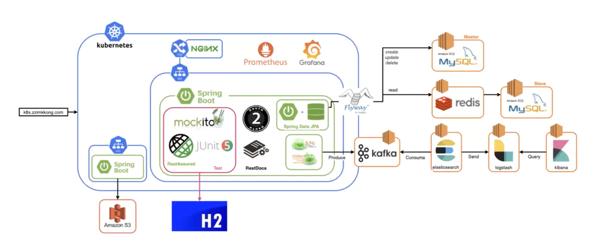
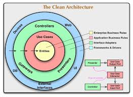
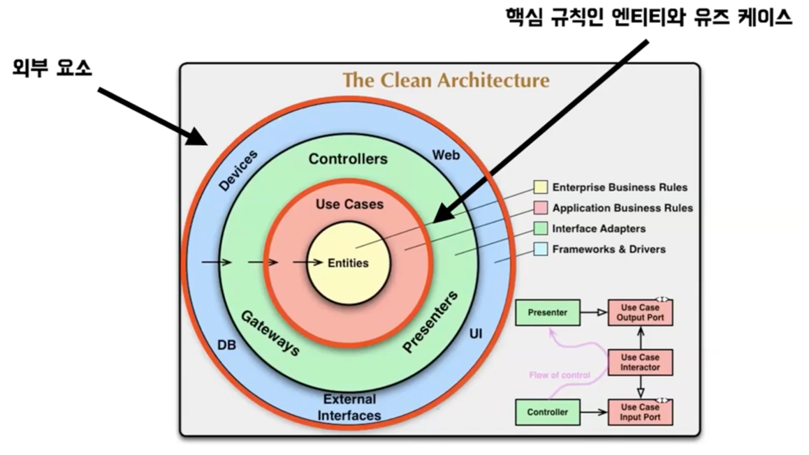
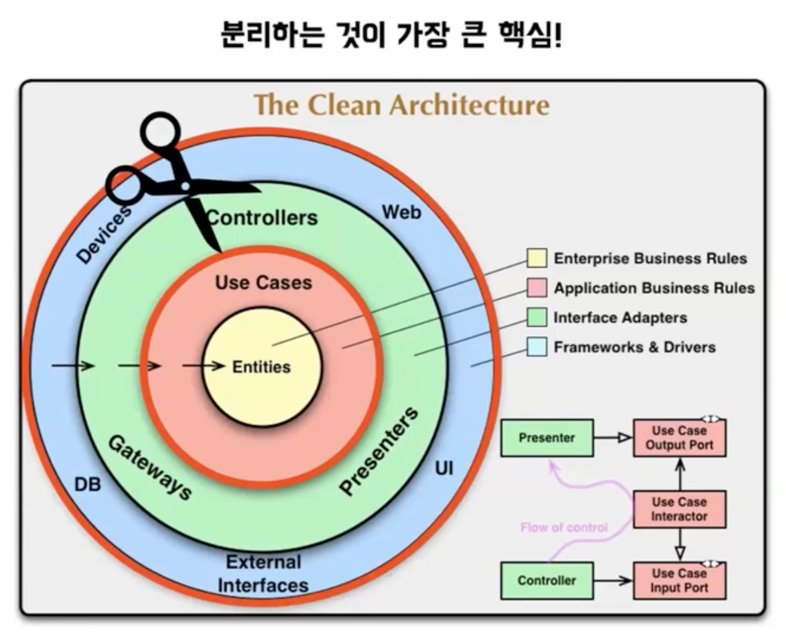

# 아키텍처

어떤 대상의 구성과 동작 원리, 구성 요소간의 관계 및 시스템 외부 환경과의 관계를 설명하는 하나의 설명서

## 시스템 아키텍처

## 소프트웨어 아키텍처

소프트웨어 구성요소들 사이 관계를 표현

기능 좋음 + 구조 부족 => 당장은 좋지만 수정 비용이 너무 크다.

기능 부족 + 구조 좋음 => 당장은 부족하지만 수정하는데 비용이 적다. 개선, 확장에 유연하다

## 레이어드 아키텍처 (계층형 아키텍처)

관심사가 같은 코드들을 계층으로 그룹화

- 계층화로 인한 분리된 책임
- 편의에 따라 여러 계층 추가가 가능하다
- 구조가 쉽고 단순하고 익숙하다 
- 데이터베이스 주도 설계가 될 수 있다

client -> presentation -> application -> persistence

레이어드 아키텍처는 상위 레이어가 하위 레이어를 알게 되기 때문에 하위 레이어의 변경이 상위 레이어에 영향을 준다.
=> 의존성이 생기기 때문에 코드 변경에 대한 영향이 계층간 영향을 준다.

## 클린 아키텍처 

의존성 역전을 통해 도메인이 중심

의존성 방향이 한 방향으로 흐르는 것은 동일하다

핵심 규칙을 담고 있는 도메인이 중심

도메인이 세부 사항에 의존하지 않는다
( 세부사항 -> 입출력 장치, DB, 웹 시스템, 서버, 프레임워크, 통신 프로토콜 등 ... )
JAVA에서는 POJO를 제외한 모든 부분이라고 보면 된다. 

익숙하지 않을 수 있고 레퍼런스가 적다

클린 아키텍처는 총 4개의 레이어로 구성되어 있다.

1. Entity Layer

애플리케이션의 핵심적인 엔티티나 도메인 객체가 위치

비즈니스 로직이나 규칙을 나타내며, 외부 요소에 대한 어떠한 의존성도 가지지 않는다.

2. Use Cases Layer

특정 비즈니스 로직을 포함하여 데이터 저장, UI 등은 관심 없다.

3. Interface Adapters Layer

데이터를 애플리케이션에서 사용하는 형태로 변환하거나, 내부에서 사용하는 데이터를 외부에 적합한 형태로 변환

4. Infrastructure Layer

DB와 프레임워크와 같은 외부와의 통신을 담당하는 계층이다.

## 헥사고날 아키텍처

클린 아키텍처를 적용하기 아주 좋은 레퍼런스

외부 요소와 핵심 비지니스 로직이 소통할 때, 포트를 통해서 간접적으로 통신

**특징**

- 큰 비즈니스 가치를 가지고 있는 도메인 모델이 큰 관심
- 레퍼런스가 클린 아키텍처에 비해 많다
- 포트와 어댑터를 구성하고 관리하는데 복잡성이 따른다
- 도메인에 라이브러리를 직접 활용하기 어렵다

#### 도메인 모델 (Domain Model) 

=> 애플리케이션의 핵심 기능, 비즈니스 로직이나 규칙을 캡슐화

#### 포트 (Port) 

=> 애플리케이션의 도메인 모델과 외부의 통신 인터페이스를 정의

#### 어댑터 (Adapter) 

=> 특정 포트에 연결되어 외부와 도메인간 통신을 가능하게 한다 

=> 외부 요소(웹 요청, 데이터베이스 등)와 실제 통신이 발생

=> 라이브러리나 프레임워크에 종속적인 코드가 존재

=> 포트를 구현하기도 하고 포트를 통해 use case를 직접 호출하기도 한다

#### 언제 쓰면 좋을까?? 

1. 대규모의 프로젝트를 진행할 때
2. 프로젝트 일원 모두 클린 아키텍처를 이해하고 있을 때
3. 외부 요소의 변화가 잦을 때

---

## 출처

https://www.youtube.com/watch?v=Ql7CoQminoM
