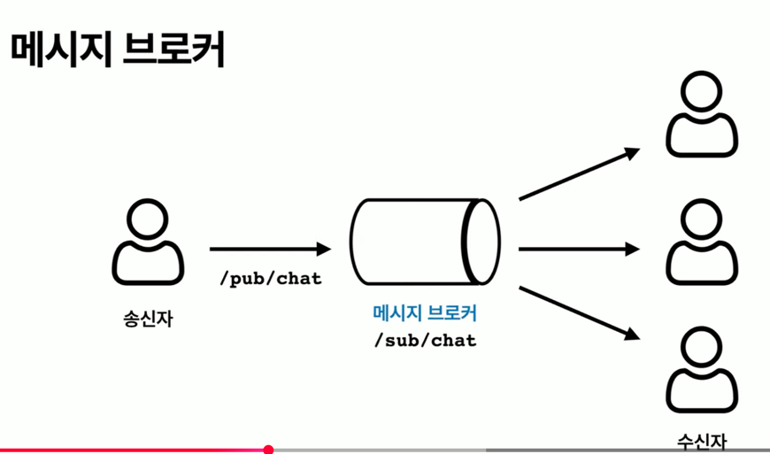

## WebSocket API

Spring은 WebSocket 메시지를 처리하는 클라이언트 및 서버 측 애플리케이션을 작성하는 데 사용할 수 있는 WebSocket API를 제공합니다.

WebSocket 서버를 만드는 것은 WebSocketHandler를 구현하거나, 더 일반적으로는 TextWebSocketHandler 또는 BinaryWebSocketHandler를 확장하는 것만큼 간단합니다.

https://docs.spring.io/spring-framework/reference/web/websocket/server.html

## Spring Websocket

Spring 자체가 직접 소켓을 저수준에서 잡고 있는 것이 아니라, Spring Boot에 내장된 서블릿 컨테이너 (주로 Tomcat)가 실제 연결을 관리합니다.

Spring인 이를 추상화하여 Handler만 작성하면 되게뜸 도와준다.

**I/O 스레드 할당**

- 웹소켓을 통해 메시지가 오면, 서블릿 컨테이너의 Worker Thread 하나가 handleTextMessage를 실행한다.

**동기적 실행**

- 스레드는 동기적으로 동작한다.

**병목 위험**

- 동기적으로 동작하는 스레드에서 복잡한 계산을 하거나 DB 에 데이터를 저장(Blocking I/O)하면, 다음 메시지를 받아야 할 스레드가 묶여버립니다.

- 이런 상황에서 바이낸스 처럼 초당 수백 개의 데이터가 쏟아지는 환경에선 Backpressure(역압력) 문제가 발생하여 연결이 끊길 수 있습니다.


---

## STOMP (Simple Text Oriented Messaging Protocol)

클라이언트와 서버가 이해할 수 있는 구조화된 형식이 필요. Spring에서는 STOMP 메시지 프로토콜을 사용하고 있다.

메세지 브로커를 활용하여 쉽게 메시지를 주고 받을 수 있는 프로토콜

- Pub-Sub(발행-구독) : 발신자가 메시지를 발행하면 수신자가 구것을 수신하는 메시징 페러다임
- 메시지 브로커 : 발신자의 메시지를 받아와서 수신자들에게 메시지를 전달하는 어떤 것

애플리케이션 간 데이터 전송에 사용되는 간단한 텍스트 기반 프로토콜입니다.

웹소켓 위에 얹어 함께 사용할 수 있는 하위(서버) 프로토콜


```STOMP
COMMAND
header1:value1
header2:value2

Body^@
```

```STOMP
SEND
destination:/topic/room1
content-type:application/json

{"sender":"행성이", "message":"안녕 친구들!"}
```

command -> 무엇을 할 것인지 지시하는 명령어
header:value -> 명령에 대한 추가 정보나 옵션
body -> 실제 전송할 메시지 내용

STOMP는 Pub/Sub 구조를 지원하기 때문에 하나의 메시지를 여러 구독자에게 전송할 수 있다.

---

- WebSocket을 연결하여 양방향 실시간 통신이 가능
- STOMP는 구조화된 메시지 프로토콜로 pub/sub 패턴 지원
- Spring 에서는 STOMP를 이용하여 실시간 통신이 가능

---

메시지 브로커

메시지 브로커는 메시지 전송을 중개하는 역할을 한다.

송신자는 publish만 잘 해주면 된다. 수신자가 누구인지 몇 명인지 알 필요가 없다!

수신자는 메시지를 보내는 사람이 누구인지 전혀 알 필요가 없다.

관심사가 분리된다!



메시지 브로커는 분산 환경에서 문제가 발생한다

기본 구현 시 인메모리 메시지 브로커를 사용하기 때문

Was가 한대만 존재한다면 같은 서버를 바라보는 사용자에게만 메시지가 전송된다. 

레빗MQ나 카프카 같은 메시지 브로커를 통해서 이런 문제를 해결할 수 있습니다.

https://docs.spring.io/spring-framework/reference/web/websocket/stomp.html
